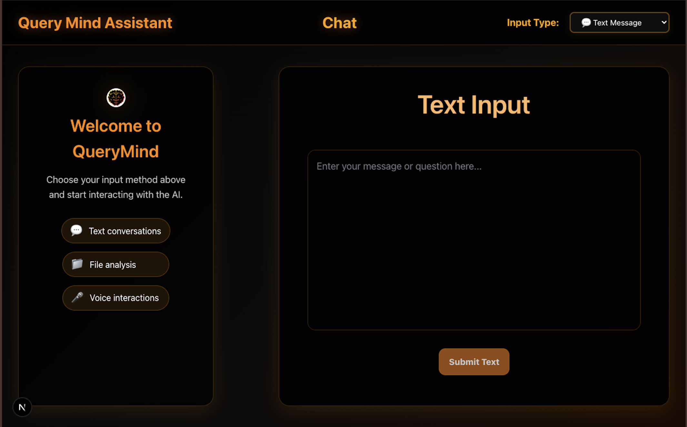

# QueryMind

**QueryMind** is an intelligent file-based knowledge querying system where users can upload audio files, text, or documents, and later ask questions based on the stored knowledge. Powered by vector embeddings and storage infrastructure, it allows seamless interaction both via web and Telegram.

---

## Features

* Upload audio, text, and general files
* Extract and store knowledge from files using vector embeddings
* Ask questions and get intelligent answers based on uploaded content
* Telegram bot integration for remote access and interaction
* Built with **Next.js**, **ChromaDB**, and **Storacha MCP**

---

## 🧱 Tech Stack

* **Next.js** – Web interface and server-side logic
* **ChromaDB** – Vector database to store and query embeddings
* **Storacha MCP Server** – For secure file storage and handling
* **Telegram Bot API** – For conversational interface via Telegram

---

## 📂 File Handling

* Users can upload:
  * `.txt`, `.md` (Text files)
  * `.pdf`, `.docx`, and other document formats
* Assets are stored in the `/public` directory

---

## 🛠️ Environment Variables

Create a `.env` file in the root with the following:

```env
MCP_SERVER_URL=<Your MCP server endpoint>
CHROMA_DB_URL=<Your ChromaDB endpoint>
TELEGRAM_BOT_TOKEN=<Your Telegram Bot token>
TELEGRAM_CHAT_ID=<Allowed chat ID or admin>
```

---

## 🧪 Local Development

```bash
git clone https://github.com/yourusername/querymind.git
pnpm install
npm run dev
```

Visit [http://localhost:3000](http://localhost:3000)

---

## 🤖 Telegram Integration

* The Telegram bot allows users to interact with the stored knowledge from their devices.
* Make sure to deploy the bot backend and keep it running for real-time responses.

---

## 📸 Screenshots

> Add screenshots/gifs in the `public/` folder and display them here

```md


```

---

## 📄 License

MIT License

---

